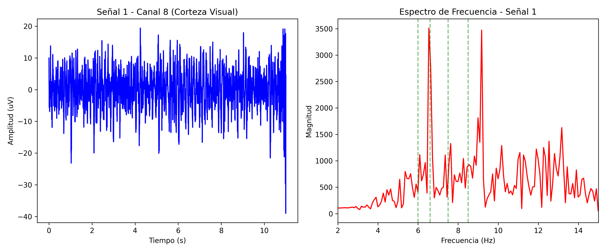
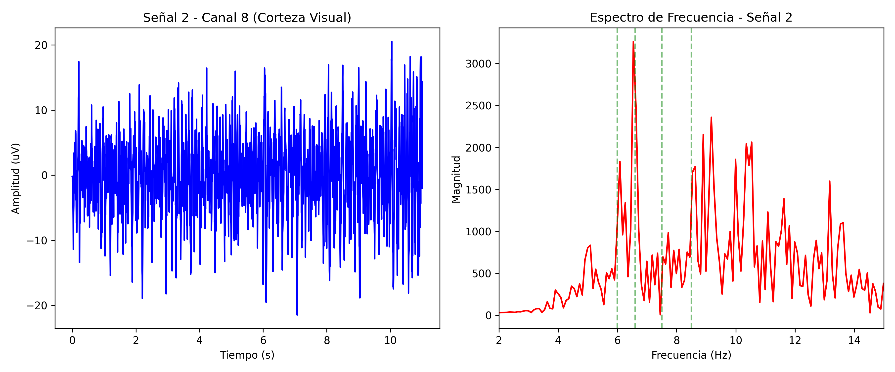
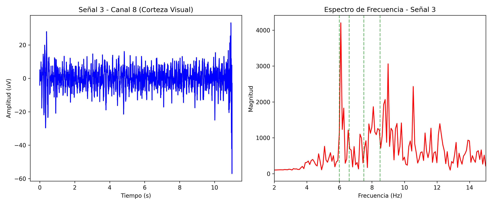
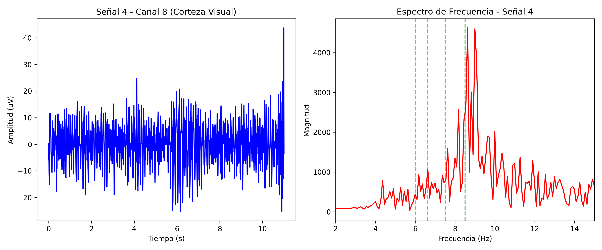
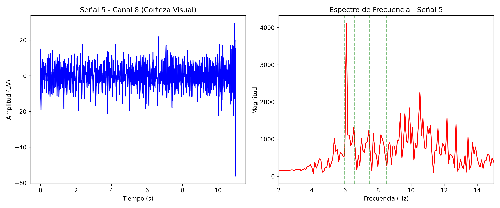

# Señales SSVEP: Procesamiento y Análisis de Frecuencias Visuales

## Abstract
Este proyecto automatiza la extracción, limpieza y procesamiento de señales de electroencefalograma (EEG) utilizando potenciales evocados visuales de estado estable (SSVEP). El script toma datos registrados en múltiples canales desde un archivo comprimido `.rar`, extrae la información del Canal 8 (corteza visual), y le aplica filtros de procesamiento digital (filtro Notch para ruido de red eléctrica y Pasa-Altas para ruido basal). Finalmente, computa y genera visualizaciones del espectro de frecuencias (FFT) donde se detectan los estímulos visuales específicos.

## Modo de Uso
Asegúrate de contar con el archivo de registro (ej. `senales.rar`) en el mismo directorio.

Para ejecutar todo el pipeline automáticamente desde la consola a través de `uv`, usa el siguiente comando:

```bash
uv run python main.py senales.rar
```

## Flujo de Trabajo
Al ejecutar el comando principal, el programa realiza las siguientes etapas:

1. **Extracción y Transformación (`lectura.py`)**: 
   Descomprime internamente el archivo `.rar` que agrupa las bioseñales. Toma cada archivo `.csv`, infiere la transposición correcta de la matriz de datos (Muestras vs Canales) y genera documentos preprocesados temporalmente para aislar los 9 canales EEG principales.
   
2. **Preprocesamiento y Filtraje (`preprocesamiento.py`)**: 
   Aisla el **Canal 8**, correspondiente típicamente a la región occipital visual. Le aplica:
   - **Filtro Notch (60 Hz)**: Elimina el ruido provocado por la interferencia natural de la línea de corriente.
   - **Filtro Pasa-Altas (> 5 Hz)**: Recorta ruidos corporales basales de muy baja frecuencia.
   
3. **Análisis de Fourier y Gráficas (`plot.py`)**: 
   Convierte las bioseñales limpias en el dominio del tiempo hacia el dominio frecuencial aplicando una Transformada Rápida de Fourier (FFT). Destaca visualmente sobre las frecuencias de interés las zonas donde debe existir el enganche visual SSVEP.

## Resultados
A continuación se observan los espectros de energía frecuencial de las diversas señales analizadas. En las frecuencias bajas, observamos resaltado el pico provocado por el estímulo visual:

### Señal 1

*Figura 1: Espectrograma de la primera señal. El pico principal se observa en **6.6 Hz**, indicando el comando **"Apagar"**.*

### Señal 2

*Figura 2: Espectrograma de la segunda señal. Replicando el espectro de la anterior, su pico de acoplamiento es en **6.6 Hz**, siendo el comando **"Apagar"**.*

### Señal 3

*Figura 3: Espectrograma de la tercera señal. Cambia el enfoque atencional, y se observa su frecuencia en enganche de fase coincidente a los **6.0 Hz**, que significa el comando **"Encender"**.*

### Señal 4

*Figura 4: Espectrograma de la cuarta señal. Resalta agudamente un estímulo en los **8.5 Hz**, correspondiente al comando de **"Bajar temperatura"**.*

### Señal 5

*Figura 5: Espectrograma de la quinta señal SSVEP analizada. El foco visual vuelve a los **6.0 Hz**, indicando de nuevo enviar la señal de **"Encender"**.*

> **Guía de Frecuencias Obtenidas:**
> Dependiendo del pico mayor detectado en cada gráfica de manera individual, interpretamos el registro neurofisiológico según los siguientes comandos atencionales:
> - **6.0 Hz:** Encender sistema.
> - **6.6 Hz:** Apagar sistema.
> - **7.5 Hz:** Subir temperatura.
> - **8.5 Hz:** Bajar temperatura.
